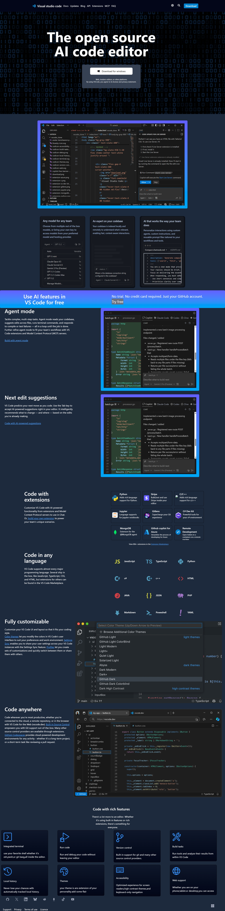

# VS Code Landing Page Clone 🚀

A responsive **Visual Studio Code landing page clone** built using **HTML** and **Tailwind CSS**.  
This project recreates the modern UI of the VS Code website with sections like navbar, hero, extensions, languages, features, and footer.

---

## sample

## 🔥 Features

- 🎨 Modern UI inspired by VS Code official website
- 📱 Responsive design (mobile, tablet & desktop)
- ⚡ Built using Tailwind CSS utility classes
- 🧩 Multiple sections:
  - Navbar with menu & icons
  - Hero section with download CTA
  - Feature sections (Agent Mode, AI Suggestions)
  - Extensions showcase
  - Programming languages grid
  - Rich features cards
  - Footer with social links
